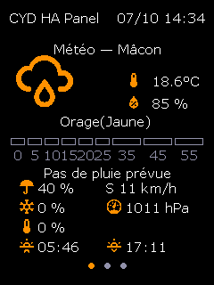
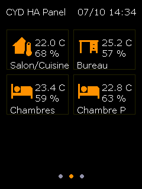
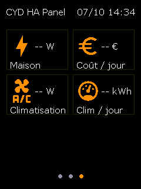
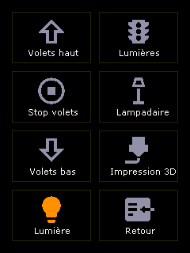
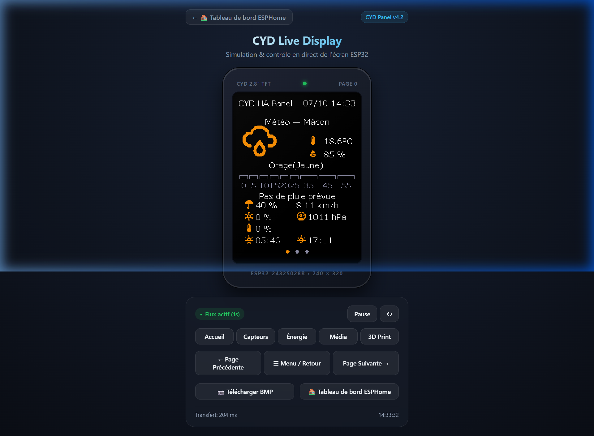

# ESP32 CYD Home Assistant Touch Panel

> Current version: **v4.2**

[](https://github.com/gubas/cyd_HA/actions/workflows/esphome.yml)

 

A smart touch panel to control Home Assistant using an ESP32-2432S028R (CYD - Cheap Yellow Display).

## 📋 Features

- **Multi-page display**: Dynamic screens with 8-second auto-cycling
  - **Weather Page**: Current conditions with animated weather icon, outdoor temperature, rain, wind, snow, frost, and real-time Météo-France alerts (yellow/orange/red vigilance)
  - 🌧️ **Rain forecast**: 9 colored rectangles showing minute-by-minute forecast (0–55 min) with intuitive color coding (empty=dry, light/medium/dark blue = light/moderate/heavy rain)
  - **Sensors Page**: Temperature and humidity from up to 4 zones in a 2x2 grid layout
  - **Energy & Climate Page**: Home power (W/kW), electricity cost today (€), air conditioning power (W/kW), and AC energy consumption (kWh)
  - **Media Page**: Now Playing (Artist & Title) with automatic text wrapping and dynamic layout
  - **Printer Page**: Real-time BambuLab status (file, progress, nozzle/bed temps, remaining time)
  - **Dynamic Pagination**: Dots indicator adjusts automatically (3/4/5 dots) based on active pages (Media/Printer hidden when unused)
- **Live Web Simulator & Screen Mirror**:
  - 🖥️ **Interactive Simulator (`/screen`)**: Realistic CYD device enclosure mockup with live auto-refresh (1s), touchscreen click simulation, quick navigation pills (Home, Sensors, Energy, Media, 3D), menu toggle, and latency telemetry.
  - 📷 **Zero-RAM Framebuffer Stream (`/screenshot.bmp`)**: Pixel-perfect 8-bit indexed BMP directly streamed over HTTP chunk by chunk from the display buffer. Ideal for Home Assistant picture entities or remote viewing without requiring PSRAM!
  - 🕹️ **Control API (`/api/screen/page`)**: Remote HTTP endpoints to switch pages (`?page=N`) or toggle the configuration menu (`?action=toggle_menu`).
- **Embedded Web Server**: Modern ESPHome v3 responsive web dashboard accessible via browser (port 80)
- **Control menu**: Touch-activated, 8 configurable buttons to control Home Assistant entities (covers, lights, 3D printer)
  - Clean interface without header to maximize button space
  - Visual feedback with colored icons (blue = active, grey = inactive)
  - Full internationalization (EN/FR/ES) via dedicated language files
- **Easy Wi-Fi Setup & Zero-Friction Provisioning**:
  - 📷 **On-Screen QR Code**: When disconnected, the CYD automatically displays a QR code on screen. Scan with your smartphone camera to connect to the fallback hotspot (`CYD-HA-Fallback`) and open the captive portal (`http://192.168.4.1`).
  - 🔌 **Improv Serial USB Provisioning**: Plug the CYD via USB and open [web.esphome.io](https://web.esphome.io) or the included Web Flasher in Chrome/Edge to send Wi-Fi credentials in 1 click without any phone.
  - ℹ️ **On-Screen IP Diagnostics**: Assigned IP address is displayed on boot in the top header and at the bottom of the touch menu (`IP: 192.168.1.84 | v4.2`).
- **Global header**: Device name and date/time (DD/MM HH:MM) on data pages
- **Responsive touch interface**: Precise detection with XPT2046 calibration
- **Secure connection**: Encrypted API, password-protected OTA
- **Modular architecture**: Configuration split into separate files for easy maintenance
- **Auto-return**: Automatic return to display cycle after 10s menu inactivity

## 📸 UI Gallery

### Physical Display Screens & Touch Menu

| ☀️ Weather & Alerts | 🌡️ Indoor Sensors | ⚡ Energy & Climate | 🔘 8-Button Touch Menu |
| :---: | :---: | :---: | :---: |
|  |  |  |  |

### 🖥️ Interactive Web Simulator (`/screen`)

A real-time digital twin accessible directly at `http://<CYD_IP_ADDRESS>/screen` or through the navigation banner on the ESPHome dashboard:

<p align="center">
  
</p>

## 🏠 Home Assistant Integration

You can easily integrate your live CYD screen into Home Assistant dashboards:

### 1. Live Screen Picture Entity (Generic Camera)
Display the real-time CYD display buffer on any Lovelace dashboard:

1. In Home Assistant, go to **Settings** → **Devices & Services** → **Add Integration** → **Generic Camera**.
2. Configure:
   - **Still Image URL**: `http://<CYD_IP_ADDRESS>/screenshot.bmp`
   - **Frame Rate**: `1` fps
3. Add a **Picture Entity** card to your dashboard:
   ```yaml
   type: picture-entity
   entity: camera.cyd_live_screen
   name: CYD Screen
   show_state: false
   tap_action:
     action: url
     url_path: http://<CYD_IP_ADDRESS>/screen
   ```

### 2. Interactive Simulator Card (Webpage / Iframe)
Embed the interactive touch simulator and remote page switcher directly in Home Assistant:

```yaml
type: iframe
url: http://<CYD_IP_ADDRESS>/screen
aspect_ratio: 75%
```

## 🛠️ Required Hardware

- **ESP32-2432S028R** (Cheap Yellow Display)
  - ESP32 (240 MHz dual-core)
  - ILI9342 320x240 TFT display (mipi_spi driver)
  - XPT2046 touch controller
  - Built-in RGB LED
  - PWM backlight

## 📁 Project Structure

```
cyd_HA/
├── cyd_ha.yaml                # ✅ Main configuration file
├── cyd_ha_refactored.yaml     # 🔄 Backward compatibility shim
├── cyd_screen_streamer.h      # 📺 Live screen streamer & Web simulator
├── docs/                      # 🖼️ Documentation & screenshots
│   └── images/
├── web_flasher/               # 🌐 ESP Web Tools browser installer
│   ├── index.html
│   └── manifest.json
├── cyd_ha/                    # 📂 Module subfolder
│   ├── substitutions.yaml     # ⚙️ All user configuration
│   ├── common.yaml            # 🎨 UI resources (fonts, colors, icons)
│   ├── hardware.yaml          # 🔧 Hardware config (SPI, touch, outputs)
│   ├── sensors.yaml           # 📊 Home Assistant sensor integration
│   ├── buttons.yaml           # 🔘 Touch zone definitions
│   ├── display_pages.yaml     # 🖥️ UI rendering logic
│   └── i18n/                  # 🌍 Language packs
│       ├── en.yaml
│       ├── fr.yaml
│       └── es.yaml
├── secrets.yaml               # 🔐 Credentials (shared across ESPHome projects)
├── secrets.yaml.example       # 📄 Secrets template
├── esphome-build-upload.bat   # 🪟 Windows build & flash script
├── esphome-build-upload.sh    # 🐧 Linux/macOS build & flash script
├── materialdesignicons-webfont.ttf  # 🎨 Weather icon font
├── CHANGELOG.md               # 📝 Version history
└── README.md                  # 📖 This file
```

## 🚀 Quick Start

### 1. Prerequisites

- [ESPHome](https://esphome.io/) installed
- Working Home Assistant with API enabled
- USB connection to ESP32

### 2. Configuration

#### a) Create `secrets.yaml`

Create `secrets.yaml` (can be shared across all ESPHome projects):

```yaml
# Global WiFi (shared)
wifi_ssid: "YOUR_SSID"
wifi_password: "YOUR_WIFI_PASSWORD"

# Project-specific secrets (prefixed with "cyd_ha")
cyd_ha_api_encryption_key: "YOUR_API_KEY"
cyd_ha_ota_password: "YOUR_OTA_PASSWORD"
cyd_ha_ap_ssid: "CYD HA Fallback Hotspot"
cyd_ha_ap_password: "CHANGE_ME_12345"
```

#### b) Download Material Design Icons font

[Download MaterialDesignIcons](https://github.com/Templarian/MaterialDesign-Webfont/blob/master/fonts/materialdesignicons-webfont.ttf)

#### c) Customize entities in `cyd_ha/substitutions.yaml`

All configuration is centralized in this file:

```yaml
# ─── Device ──────────────────────────────────────────────────
device_name: cydhapanel
device_friendly_name: CYD HA Panel

# ─── Location ────────────────────────────────────────────────
location_name: Paris

# ─── Weather ─────────────────────────────────────────────────
weather_entity: weather.paris
rain_chance_entity: sensor.paris_rain_chance
# ... more entities

# ─── Media Player ────────────────────────────────────────────────────────────
media_player_entity: media_player.example

# ─── Sensor Blocks (up to 4) ─────────────────────────────────
sensor_bloc1_temp_entity: sensor.living_room_temperature
sensor_bloc1_hum_entity: sensor.living_room_humidity
sensor_bloc1_icon: hometemperature
# ... repeat for bloc2, bloc3, bloc4 (use sensor.none to disable)

# ─── Energy & Climate (up to 4 blocks) ───────────────────────
energy_power_entity: sensor.home_power_w
energy_cost_entity: sensor.electricity_cost_today_eur
ac_power_entity: sensor.ac_power_w
ac_energy_entity: sensor.ac_energy_today_kwh

# ─── Menu Buttons ────────────────────────────────────────────
btn1_service: cover.open_cover
btn1_entity: cover.living_room_blinds
# ... configure all 7 buttons
```

### 3. Flash
 
```bash
# Compile and upload
esphome run cyd_ha.yaml
```

Or use the helper scripts:

**Windows**:
```cmd
esphome-build-upload.bat
```

**Linux / macOS**:
```bash
./esphome-build-upload.sh        # OTA upload
./esphome-build-upload.sh -u     # USB upload
```

## 🎨 Customization

### Change colors

Edit `cyd_ha/common.yaml`:

```yaml
color:
  - id: blue
    hex: 'F39621'  # Change this value (BGR format)
```

### Add icons

1. Find icon on [Material Design Icons](https://pictogrammers.com/library/mdi/)
2. Add to `cyd_ha/common.yaml`:

```yaml
image:
  - file: mdi:YOUR_ICON
    id: my_icon
    resize: 40x40
    type: BINARY
```

### 🌍 Localization (i18n)

The UI uses dedicated language packs.

**Available packs**: `en.yaml`, `fr.yaml`, `es.yaml`

**Activate** by uncommenting ONE line at the top of `cyd_ha/substitutions.yaml`:

```yaml
<<: !include i18n/en.yaml     # ← English
# <<: !include i18n/fr.yaml
# <<: !include i18n/es.yaml
```

**Translated keys**:
- Page titles: `i18n_weather_title`, `i18n_sensors_title`, `i18n_printer_title`
- Menu buttons: `btn1_label` to `btn8_label`
- Sensor blocks: `sensor_bloc1_label` to `sensor_bloc4_label`
- Rain messages: `i18n_next_rain_prefix`, `i18n_next_rain_none`

## 🐛 Troubleshooting

### "Could not connect to WiFi"
- Check `secrets.yaml` (correct SSID/password)
- 5GHz WiFi is not supported (use 2.4GHz)

### Touchscreen not responding
- Adjust calibration in `cyd_ha/hardware.yaml`:

```yaml
touchscreen:
  calibration:
    x_min: 280
    x_max: 3860
    y_min: 280
    y_max: 3860
```

### Sensors show "--"
- Verify `entity_id` in `substitutions.yaml` matches Home Assistant entities
- Check API connection in Home Assistant

## 📊 Technical Architecture

### Data Flow

```
Home Assistant API
        ↓
  cyd_ha/sensors.yaml (import entities)
        ↓
  cyd_ha/display_pages.yaml (rendering with 8s auto-cycle)
        ↓
    ESP32 Display (mipi_spi - ESP32-2432S028-9342, 270° rotation)
```

### Pages & Navigation

```
Dynamic Pages with auto-cycling (8s):
┌─────────────────────────────────────┐
│ Page 0: Weather                     │
│  - Large animated weather icon      │
│  - Météo-France alerts (🔴🟠🟡)     │
│  - Rain forecast: 9 colored bars    │
│  - "Next rain: X min" text          │
│  - Temp/Rain/Wind/Snow/Frost grid   │
├─────────────────────────────────────┤
│ Page 1: Home Sensors                │
│  - 4 blocks in 2x2 grid             │
│  - Each: icon + label + temp + hum  │
├─────────────────────────────────────┤
│ Page 2: Energy & Climate            │
│  - 4 blocks in 2x2 grid             │
│  - Home power (W/kW), cost (€)      │
│  - AC power (W/kW), AC energy (kWh) │
├─────────────────────────────────────┤
│ Page 3: Media Player (conditional)  │
│  - Artist & Title text wrap         │
│  - Playing / Paused status          │
├─────────────────────────────────────┤
│ Page 4: BambuLab Printer (cond.)    │
│  - Scrolling filename               │
│  - Progress bar with percentage     │
│  - Status / Time remaining / End    │
│  - Nozzle/Bed temperatures          │
└─────────────────────────────────────┘

Touch anywhere → 8-button menu (10s timeout)
```

## 📝 Changelog

See [CHANGELOG.md](CHANGELOG.md) for version history.

## 🤝 Contributing

To improve this project:

1. Test on your hardware
2. Report bugs via issues
3. Suggest improvements
4. Share your custom configurations

## 📄 License

This project is licensed under the [GNU General Public License v2.0](LICENSE).
You are free to use, modify, and distribute this software under the terms of the GPL v2.

## 🙏 Acknowledgments

This project was inspired by the excellent tutorial from **Aguacatec**:
- [Integrar la Cheap Yellow Display en Home Assistant](https://aguacatec.es/integrar-la-cheap-yellow-display-en-ha/)

## 🔗 Resources

- [ESPHome Documentation](https://esphome.io/)
- [Home Assistant](https://www.home-assistant.io/)
- [ESP32-2432S028R](https://github.com/witnessmenow/ESP32-Cheap-Yellow-Display)
- [Material Design Icons](https://pictogrammers.com/library/mdi/)

---

**Made with ❤️ for the Home Assistant community**
