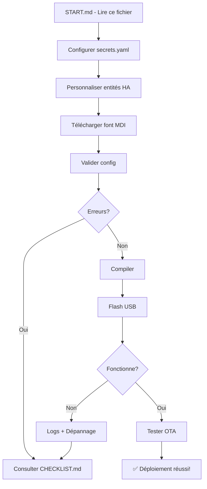

# 🚀 DÉMARRAGE RAPIDE - ESP32 CYD Touch Panel

**Bienvenue !** Votre projet a été refactorisé avec succès. Voici comment démarrer en 5 minutes.

## 📂 Structure du projet (vérifiez que tout est présent)

```
cyd_HA/
├── 📄 cyd_ha_refactored.yaml    ✅ Fichier principal (UTILISEZ CELUI-CI)
├── 🔐 secrets.yaml              ⚠️ À CONFIGURER (voir ci-dessous)
├── 📦 cyd_ha/                   ✅ Modules de configuration
│   ├── 🎨 common.yaml           ✅ Ressources UI
│   ├── ⚙️ hardware.yaml         ✅ Config matérielle
│   ├── 📊 sensors.yaml          ✅ Capteurs HA
│   ├── 🔘 buttons.yaml          ✅ Zones tactiles
│   └── 🖥️ display.yaml          ✅ Logique UI
├── ⚡ deploy.ps1                ✅ Script déploiement
├── 📖 README.md                 ✅ Documentation complète
├── 🏗️ ARCHITECTURE.md           ✅ Documentation technique
├── 🚀 INSTALLATION.md           ✅ Guide installation ESPHome
├── ☑️ CHECKLIST.md              ✅ Checklist déploiement
├── 📝 CHANGELOG.md              ✅ Résumé refactorisation
└── 🙈 .gitignore                ✅ Protection secrets
```

## ⚡ Démarrage en 5 étapes

### 1️⃣ Installer ESPHome (si pas déjà fait)

```powershell
# Ouvrir PowerShell et exécuter :
pip install esphome

# Vérifier l'installation :
esphome version
```

**Si erreur** : Consultez `INSTALLATION.md` pour guide détaillé (drivers USB, etc.)

---

### 2️⃣ Configurer secrets.yaml

Le fichier `secrets.yaml` peut être **partagé entre tous vos projets ESPHome**. Chaque projet utilise des secrets préfixés par son nom :

```yaml
# Ouvrir secrets.yaml et modifier :

# WiFi global (partagé par tous les devices)
wifi_ssid: "VOTRE_SSID_ICI"
wifi_password: "VOTRE_MOT_DE_PASSE_WIFI"

# Secrets spécifiques au projet "cyd_ha" (ce projet)
cyd_ha_api_encryption_key: "UBlyTwtLy37Uojq3/99P13a2B6SxWIBkk8RYvH9zM4Y="
cyd_ha_ota_password: "VotreMotDePasseOTA2024!"
cyd_ha_ap_ssid: "CYD HA Fallback Hotspot"
cyd_ha_ap_password: "MotDePasseFallback123"

# Pour d'autres projets ESPHome, ajoutez :
# salon_api_encryption_key: "..."
# salon_ota_password: "..."
# cuisine_api_encryption_key: "..."
```

**✅ Avantage** : Un seul fichier `secrets.yaml` pour tous vos projets ESPHome !  
**⚠️ IMPORTANT** : Ne JAMAIS commiter `secrets.yaml` (déjà protégé par `.gitignore`)

---

### 3️⃣ Personnaliser les entités Home Assistant

Ouvrir `cyd_ha_refactored.yaml` et modifier la section `substitutions` :

```yaml
substitutions:
  # Remplacer par VOS entity_id Home Assistant :
  internal_temp_sensor: sensor.VOTRE_CAPTEUR_TEMP
  internal_humidity_sensor: sensor.VOTRE_CAPTEUR_HUMIDITY
  # ... etc
  
  # Remplacer par VOS entités à contrôler :
  button1_entity: cover.VOTRE_VOLET
  button2_entity: light.VOTRE_LUMIERE
  # ... etc
```

**Astuce** : Vérifiez les `entity_id` dans Home Assistant → Outils dev → États

---

### 4️⃣ Télécharger la font Material Design Icons

```powershell
# Télécharger automatiquement :
.\deploy.ps1 -Action font

# OU manuellement :
Invoke-WebRequest -Uri "https://github.com/Templarian/MaterialDesign-Webfont/raw/master/fonts/materialdesignicons-webfont.ttf" -OutFile "materialdesignicons-webfont.ttf"
```

---

### 5️⃣ Valider et flasher

```powershell
# Option A : Menu interactif (recommandé)
.\deploy.ps1
# Choisir : 1 (valider) → 2 (compiler) → 3 (flash USB)

# Option B : Commandes directes
esphome config cyd_ha_refactored.yaml   # Valider
esphome compile cyd_ha_refactored.yaml  # Compiler
esphome run cyd_ha_refactored.yaml      # Flash USB
```

**📌 Connectez l'ESP32 via USB avant l'étape 3/flash**

---

## ✅ Vérification post-flash

Après le flash, vérifiez :

1. **Écran allumé** : Rétroéclairage actif
2. **Date/heure** : Affichée correctement
3. **Météo** : Icône affichée
4. **Touch** : Taper écran → menu s'affiche
5. **WiFi** : Logs montrent connexion réussie

```powershell
# Voir les logs en temps réel :
.\deploy.ps1 -Action logs
# Ou :
esphome logs cyd_ha_refactored.yaml
```

---

## 🆘 Dépannage rapide

### ❌ "esphome n'est pas reconnu"
**Solution** : ESPHome non installé → `pip install esphome`

### ❌ "Could not connect to WiFi"
**Solution** : 
- Vérifier `secrets.yaml` (SSID/password corrects)
- Utiliser réseau 2.4GHz (pas 5GHz)

### ❌ "Font not found"
**Solution** : Télécharger MDI → `.\deploy.ps1 -Action font`

### ❌ Tactile ne répond pas
**Solution** : Calibration nécessaire
1. Ouvrir `hardware.yaml`
2. Ajuster `x_min`, `x_max`, `y_min`, `y_max`
3. Reflasher

### ❌ Capteurs affichent "--"
**Solution** : 
- Vérifier `entity_id` dans `substitutions`
- Vérifier API Home Assistant connectée

**Pour plus de détails** : Consultez `CHECKLIST.md` (section Phase 5 - Test fonctionnel)

---

## 📚 Ressources disponibles

| Fichier | Quand le lire |
|---------|---------------|
| **START.md** | ✅ Maintenant (vous êtes ici) |
| **CHECKLIST.md** | Avant/pendant déploiement |
| **README.md** | Pour comprendre features |
| **INSTALLATION.md** | Si problème ESPHome/drivers |
| **ARCHITECTURE.md** | Pour comprendre code |
| **CHANGELOG.md** | Voir changements refactorisation |

---

## 🎯 Workflow recommandé



---

## 🚀 Next Steps (après déploiement réussi)

1. **Intégrer dans Home Assistant**
   - Ajouter intégration ESPHome
   - Tester contrôles depuis HA

2. **Personnaliser l'interface**
   - Modifier couleurs (`common.yaml`)
   - Changer icônes
   - Ajuster labels boutons (`display.yaml`)

3. **Créer automatisations**
   - Utiliser touch events
   - Contrôles avancés

4. **Maintenir le système**
   - Updates OTA réguliers
   - Backup `secrets.yaml`
   - Monitoring logs

---

## 🎉 Félicitations !

Votre projet est maintenant :
- ✅ **Sécurisé** (credentials protégés)
- ✅ **Robuste** (timer fiable, fallbacks)
- ✅ **Maintenable** (architecture modulaire)
- ✅ **Documenté** (README, ARCHITECTURE, guides)
- ✅ **Prêt pour production** 🚀

---

## 💡 Conseil pro

**Sauvegardez `secrets.yaml` maintenant** dans un endroit sûr (gestionnaire mots de passe, coffre-fort cloud chiffré, etc.). Ne le commitez JAMAIS dans Git.

---

## 📞 Besoin d'aide ?

1. Consultez `CHECKLIST.md` (section Support)
2. Forum ESPHome : https://community.home-assistant.io/c/esphome/
3. Discord ESPHome : https://discord.gg/KhAMKrd

---

**Temps estimé démarrage** : 5-15 minutes (première fois)  
**Dernière mise à jour** : Octobre 2025  

**Bon flash ! 🚀**
